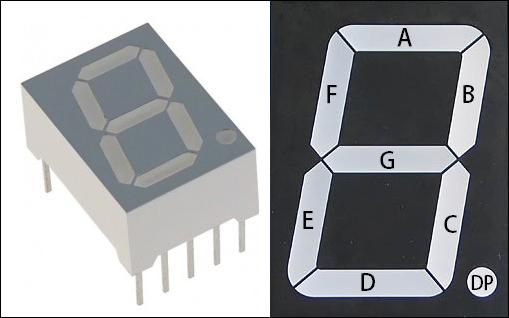
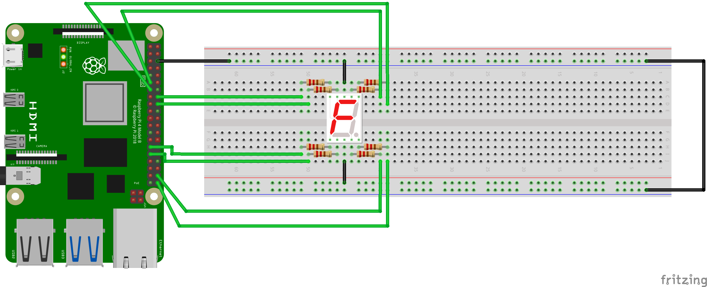
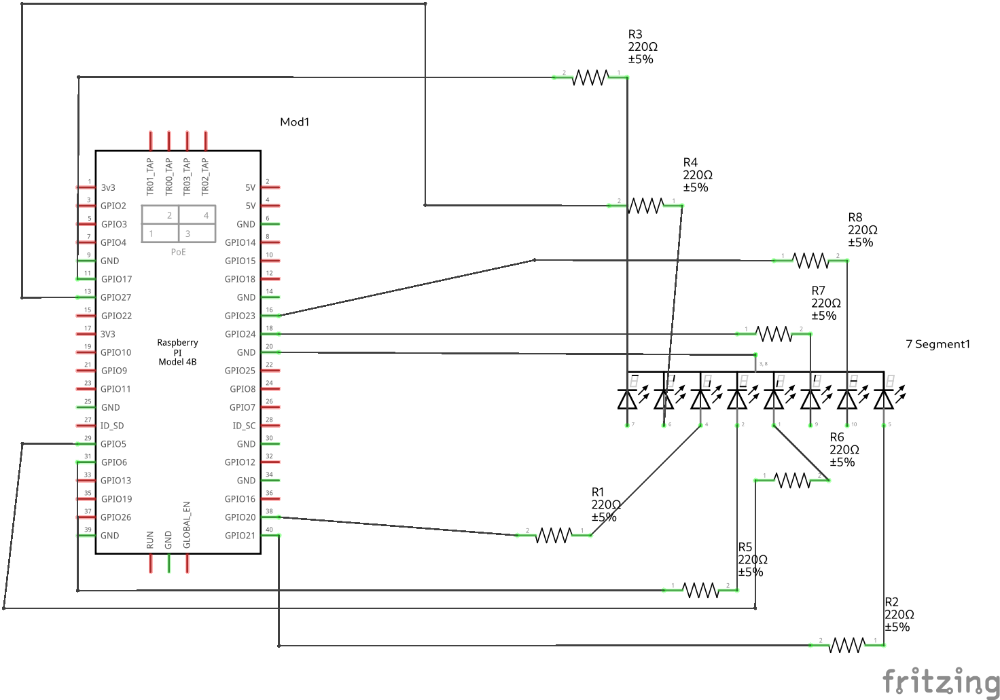

# One Digit Segment Display [5011AS]
It consists of seven individual segments arranged in the shape of a figure 8.
The segments are named starting from A to H
A to G is the seven segments that are assigned clockwise with A as the top most segment and G as the middle segment.
H is the decimal segment

A combination of segments can display different the numbers 0 to 9 and some few alphanumeric characters.
[Data Sheet](<../docs/5011AS DATA SHEET.pdf>)


<p align="center">

</p>

--- 

# Displaying all 10 single digit numbers
#### Components List
  1. 1 - 7 Segment Display (5011AS)
  1. 8 - 330Ω resitors.
  1. 9 - F to M connectors
  1. 3 - M to M connectors
 
**Note that Board numbering is used, NOT  Broadcom numbering**
1. #### Pin 6 (GND)
1. #### Pin 11 (A)
1. #### Pin 13 (B)
1. #### Pin 15 (G)
1. #### Pin 16 (H)
1. #### Pin 29 (F)
1. #### Pin 31 (E)
1. #### Pin 38 (D)
1. #### Pin 40 (C)

---
#### GPIO Pinout
Refer to this diagram to understand the pins we are using

**Note that Board numbering is used NOT  Broadcom numbering**

<p align="center">
  
</p>

---

#### Diagram Scematic

<p align="center">
  
</p>

#### Circuit Schematic
<p align="center">
  
</p>

---
#### Cycling throught the one digit numbbers
The implimentation below cycles between the one digit numbers on the display. 
To terminate it, enter the keyboard interrupt command [ctrl + C]

```py
# Controling a 7 segment display
# Component: 5011AS

import RPi.GPIO as GPIO
from time import sleep

# Board Setup
GPIO.setmode(GPIO.BOARD)

# Pi pins
aPin = 11
bPin = 13
cPin = 40
dPin = 38
ePin = 31
fPin = 29
gPin = 15
hPin = 16

GPIO.setup(aPin, GPIO.OUT)
GPIO.setup(bPin, GPIO.OUT)
GPIO.setup(cPin, GPIO.OUT)
GPIO.setup(dPin, GPIO.OUT)
GPIO.setup(ePin, GPIO.OUT)
GPIO.setup(fPin, GPIO.OUT)
GPIO.setup(gPin, GPIO.OUT)

# Segment Pins
A, B, C, D, E, F, G = aPin, bPin, cPin, dPin, ePin, fPin, gPin

# Numbers
zero = [A, B, C, D, E, F]
one = [B, C]
two = [A, B, G, E, D]
three = [A, B, G, C, D]
four = [B, C, G, F]
five = [A, F, G, C, D]
six = [A, F, E, D, C, G]
seven = [A, B, C]
eight = [A, B, C, D, E, F, G]
nine = [A, B, C, D, G, F]

numbers = [
    zero, one, two, three, four,
    five, six, seven, eight, nine
]

try:
    while True:
        for i in numbers:
            for j in i:
                GPIO.output(j, 1)
            sleep(1)
            for j in i:
                GPIO.output(j, 0)

        sleep(10)

except KeyboardInterrupt:
    GPIO.cleanup()
    print("\nExitting...\n")
```

[Code](<../../iot/basic/displays/1-7 Segment/7segment.py>)