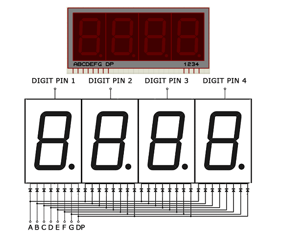

# Four Digit Segment Display [3461 AS-1]
It consists of seven individual segments arranged in the shape of a figure 8.
The segments are named starting from A to H
A to G is the seven segments that are assigned clockwise with A as the top most segment and G as the middle segment.
H is the decimal segment

Four such digits are on the display.

The digit activation pins are pins 6, 8, 9 and 12. When the pin is grounded, the digit is activated and then the pin is HIGH, the digit is off.

**Points to note**
If all digits are ON(activated), turning one segment ON turns all segments in all activated digits.

A combination of segments can display different the numbers 0 to 9 and some few alphanumeric characters.

# Data sheet
[Data Sheet](<../docs/3461AS DATA SHEET.pdf>)

--- 