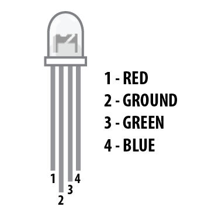
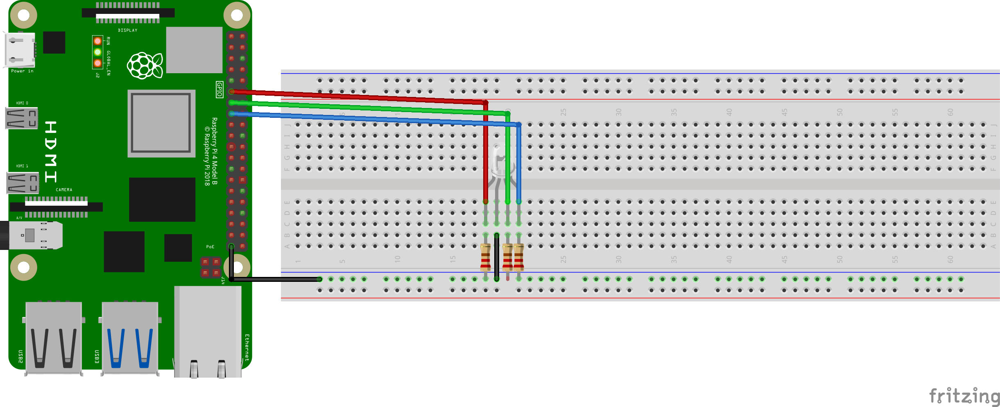
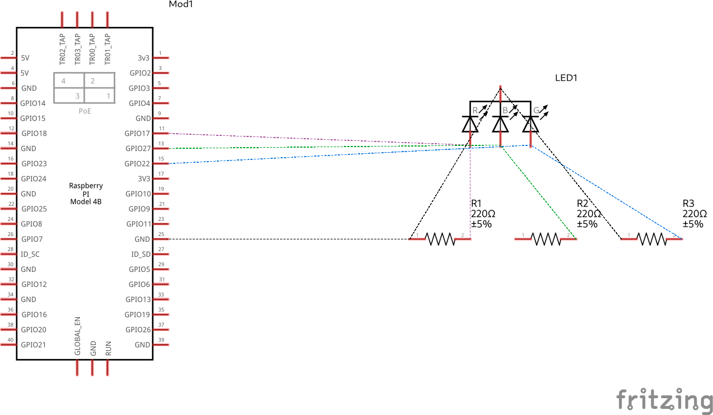

# RGB
A RGB LED is pretty similar to a normal LED in that it has a ground connection but vary's for the individual colour channels Red, Green and Blue which all have their own channel.

A common ground is shared amongst the channles and all channles require a 330 Ω resistor to avoid burning the LED out.

<p align="center">

</p>

Using [PWM](pwm.md), you can vary the intensity of each individual colour and make different combinations.

---
## Example implementation
#### Components List
  1. RGB LED
  1. 3- Resistor (330 Ω (ohms))
  1. 4 - Female to male connectors
  1. 1 - Male to male connectors
 
**Note that Board numbering is used, NOT  Broadcom numbering**
1. #### Pin 11 (RED)
1. #### Pin 13 (GREEN)
1. #### Pin 15 (BLUE)
1. #### Pin 39 (GND)


---
#### GPIO Pinout
Refer to this diagram to understand the pins we are using

**Note that Board numbering is used NOT  Broadcom numbering**

<p align="center">
  
</p>

---

#### Diagram Scematic

<p align="center">
  
</p>

#### Circuit Schematic
<p align="center">
  
</p>

---

### Description
This implementation turns ON all the individual colour components of an RGB LED. More can be achieved with [PWM](pwm.md).

###### rgb.py
```py
# Controlling a RGB LED
import RPi.GPIO as GPIO

# Board Setup
GPIO.setmode(GPIO.BOARD)

# Pins
r = 11 
g = 13
b = 15

# Pin setup
GPIO.setup(r, GPIO.OUT)
GPIO.setup(g, GPIO.OUT)
GPIO.setup(b, GPIO.OUT)

try:
  while True:
    GPIO.output(r, True)
    GPIO.output(g, True)
    GPIO.output(b, True)

except KeyboardInterrupt:
  GPIO.cleanup()
  print("\nExiting...\n")

```

The code [link](../../iot/basic/rgb_led/rgb.py)