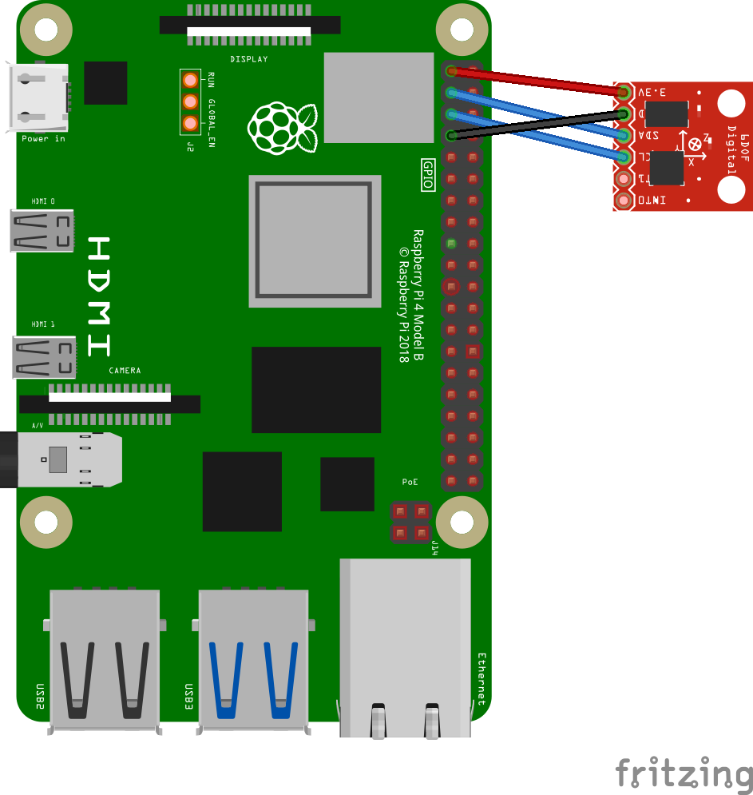
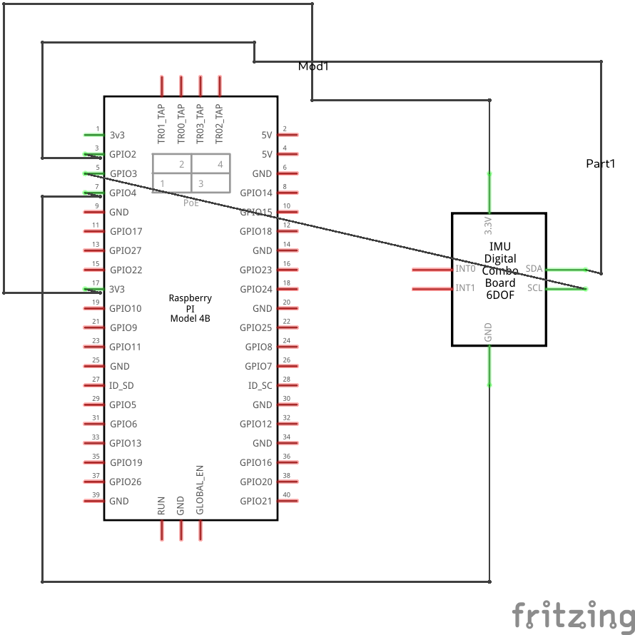
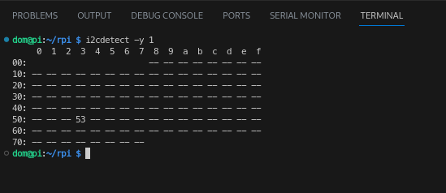
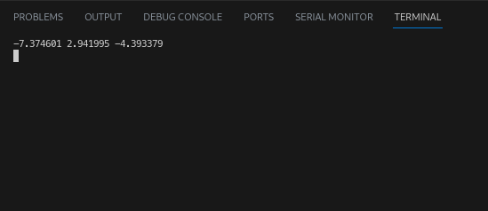

# Accelerometer [ADXL345]
The ADXL345 is a 3 axis digital accelerometer. It utilizes the **I2C** and or **SPI** protocols to commiunicate with micro-controllers.

It's application can range from motion sensing, tilt sensing, impact detection, freefall detection and vibration monitoring.

### [DataSheet](../docs/ADXL345_DATA%20SHEET.pdf)
### [Detailed Datasheet](../docs/ADXL345_More_Detailed.pdf)


# Displaying real-time 3 axis acceleration data
#### Components List
  1. 1 - ADXL345 with header pins soldered
  1. 4 - F to F connectors
 
**Note that Board numbering is used, NOT  Broadcom numbering**
1. #### Pin 2 (5V Vcc)
1. #### Pin 3 (SDA)
1. #### Pin 5 (SCL)
1. #### Pin 9 (GND)

---
#### GPIO Pinout
Refer to this diagram to understand the pins we are using

**Note that Board numbering is used NOT  Broadcom numbering**

<p align="center">
  
</p>

---

#### Diagram Scematic

<p align="center">
  
</p>

#### Circuit Schematic
<p align="center">
  
</p>

--- 

# Software Dependancies
To run Ic2, several configurations are needed.

- The below script will install all dependanies

```
sudo apt-get install python3-dev python3-dev python3-pip python3-smbus i2c-tools -y
```

- Enable the I2C interface on the pi


- Run the command below to ensure the accelerometer is being detected

```
i2cdetect -y 1
```

<p align='center'>

</p>

# IMPLIMENTATION

```py
# Print out x, y and z coordinate data 

import time 
import board
import busio 
import adafruit_adxl34x
import subprocess


i2c = busio.I2C(board.SCL, board.SDA)
accelerometer = adafruit_adxl34x.ADXL343(i2c)

try:
    while True:
      print("%f %f %f" %accelerometer.acceleration)
      time.sleep(.1)
      subprocess.run("clear", shell=True)

except KeyboardInterrupt:
    print("\nExiting...\n")
```

Code [link](../../iot/basic/accelerometer/accelerometer.py).

# Sample output

<p align='center'>

</p>