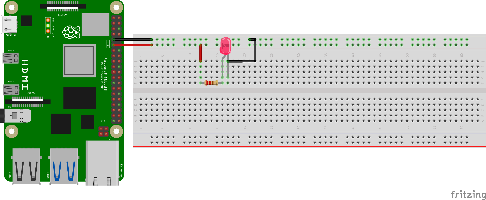
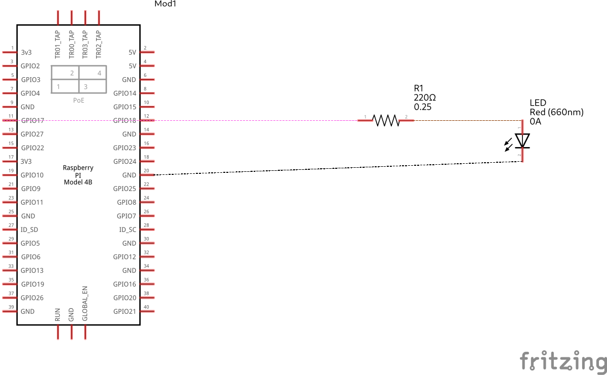

# Lighting an LED

#### Components List
  1. LED
  1. Resistor (330 Ω (ohms))
  1. 2 - Female to male connectors
  1. 2 - Male to male connectors
 
**Note that Board numbering is used, NOT  Broadcom numbering**
1. #### Pin 11 (GPIO OUTPUT PIN)
1. #### Pin 9 (GND)

---
#### GPIO Pinout
Refer to this diagram to understand the pins we are using

**Note that Board numbering is used NOT  Broadcom numbering**
1. ##### Pin 11 (GPIO OUTPUT PIN)
1. ##### Pin 9 (GND)

  

---

#### Diagram Scematic

  

#### Circuit Schematic

  

---

### Description
Making use of the python RPi library and the GPIO methods, we can make a program that blinks an LED for a indefinate number of times or for a set number of times

<!-- Blinking Gist -->


The link to the code is [here](../../iot/basic/blink.py)