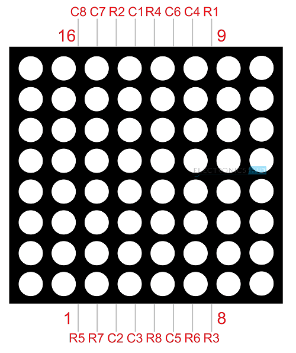

# 8X8 Matrix Display [1088AS]
It is a grid of 8 columns and 8 rows of individual LEDs. Each dot is individually controlled to form patters, letters symbols and other shapes.

# Datasheet
[1088AS DATASHEET](<../docs/1088AS DATASHEET.pdf>)

