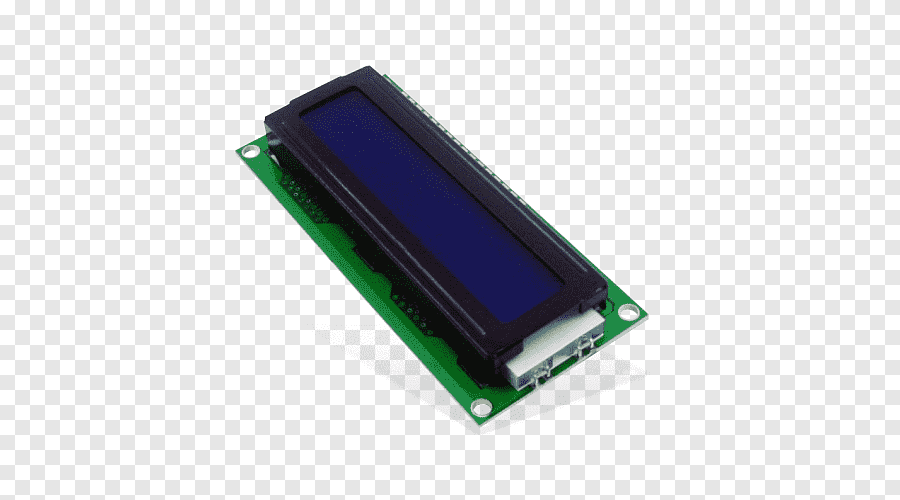
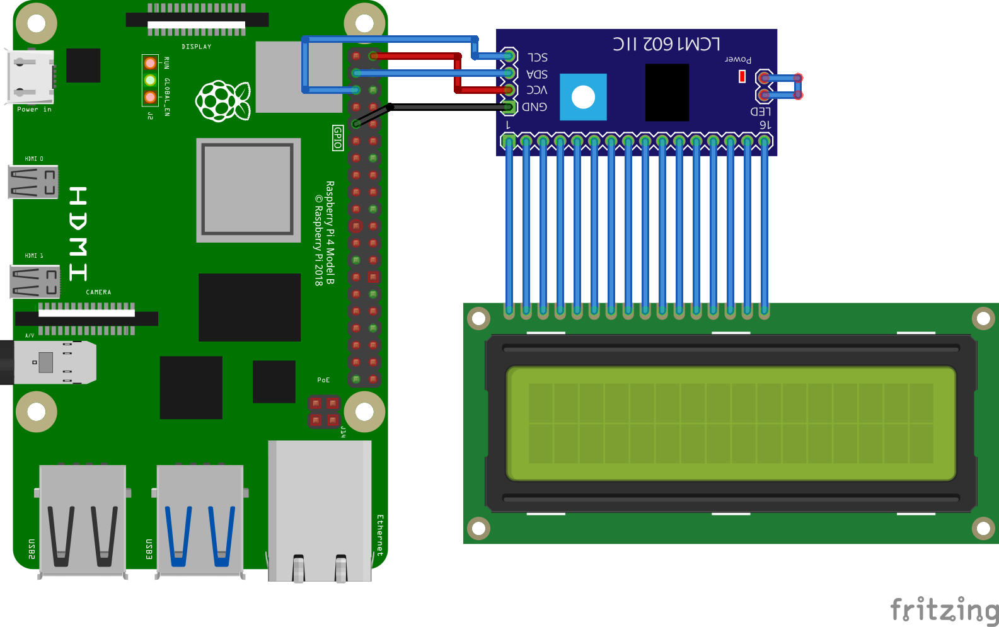
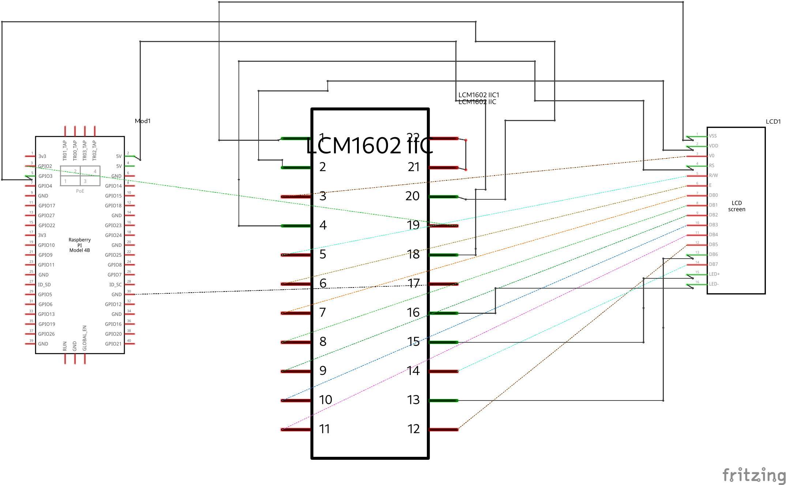
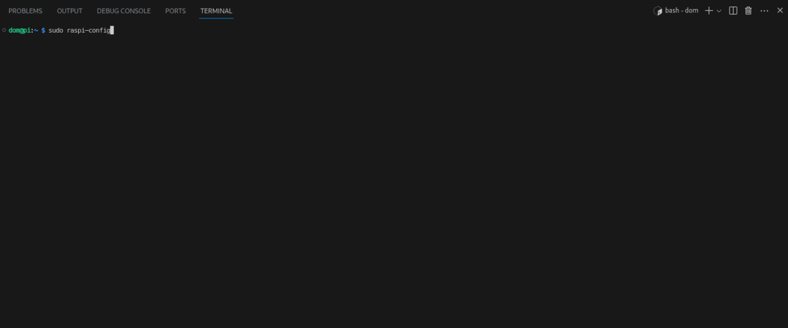
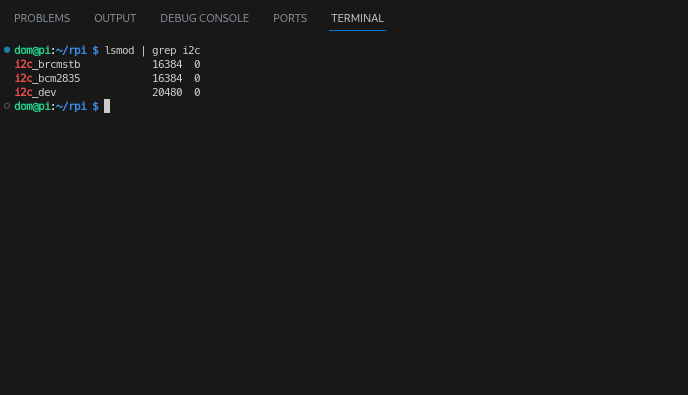

# Liquid Crystal Display [1602A]
An alphanumeric LCD consisting of 16 columns and two rows (1602).
Each character is a 5x8 dot matrix character.

For our use, an adapter is needed to simplify usage.

  ### The LCM1602 IIC1
  It utilizes the I2C protocol to simplify communication and wiring to the Pi.
  The 12C interface only needs two critical wires:
  - **SDA** Serial DAta line<tab> PIN 3
  - **SCL** Serial Clock Line<tab> PIN 5


<p align="center">

</p>

--- 

# Displaying all 10 single digit numbers
#### Components List
  1. 1 - 1602A LCD display (With Soldered LCM1062 IIC1)
  1. 4 - F to M connectors
 
**Note that Board numbering is used, NOT  Broadcom numbering**
1. #### Pin 2 (5V Vcc)
1. #### Pin 3 (SDA)
1. #### Pin 5 (SCL)
1. #### Pin 9 (GND)

---
#### GPIO Pinout
Refer to this diagram to understand the pins we are using

**Note that Board numbering is used NOT  Broadcom numbering**

<p align="center">
  
</p>

---

#### Diagram Scematic

<p align="center">
  
</p>

#### Circuit Schematic
<p align="center">
  
</p>

--- 

# Software Dependancies
To run Ic2, several configurations are needed.

## 1. RaspiConfig - Enabling the I2C interface
Firt we need to enable the I2C interface on the pi. Follow the steps below.

```
$ sudo raspi-config
```



<br>

## 2. Software
There are some dependancy libraries and tools that need to be downloaded, run the command below to get them all installed at once

```
$ sudo apt-get install i2c-tools libi2c-dev pip
```

IF everything runs sucessfully, install these Python libraries using pip3

```
$ pip install smbus2 
```

## 2.1 Confirm The Configurations
The command lsmod should return something of the sort. 

```
lsmod | grep i2c
```
<p>

</p>

---

# Showing a greeting message
This implimentation shows a greeting message on the LCD screen


Make sure the [LCD1062.py](../../iot/basic/displays/LCD/LCD1602.py) file is in the same directory as the python program below

###### display.py
```py
import LCD1602 as lcd
import time 

lcd.init(0x27, 1)

try:
  while True:
    lcd.write(0,0, 'Hi!')
    lcd.write(0,1, ':)')

except KeyboardInterrupt:
  time.sleep(0.2)
  lcd.clear()
  print('\nExiting...\n')
```

Code [link](../../iot/basic/displays/LCD/display.py).