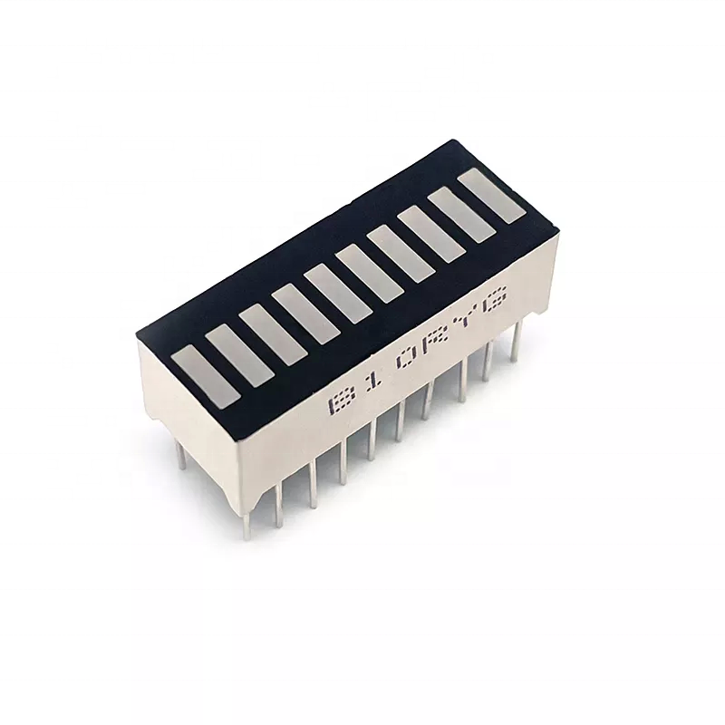
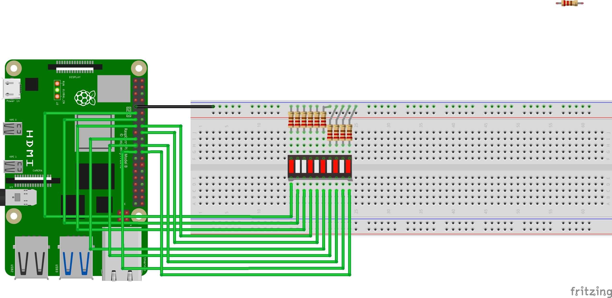
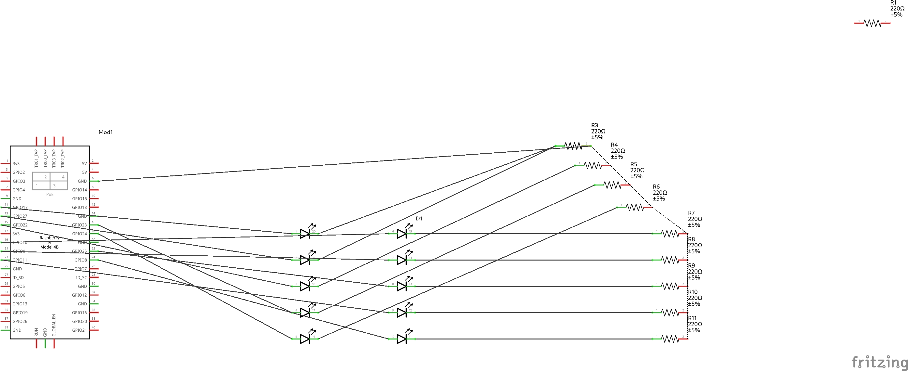

# 10 Segment LED Bar [B10BS]
It is basically 10 individual LEDs that can function as a bar graph.

It can be used in a variety of things.

# Datasheet
[B10BS DATASHEET](<../docs/B10BS DATASHEET.pdf>)

<p align="center">

</p>

---
#### GPIO Pinout
Refer to this diagram to understand the pins we are using

**Note that Board numbering is used NOT  Broadcom numbering**

<p align="center">
  
</p>

---

#### Diagram Scematic

<p align="center">
  
</p>

#### Circuit Schematic
<p align="center">
  
</p>

# Implimentation 
Turning on the led segments from the left to the right untill the bar graph is fully on.
Then repeating this indefinately.


###### 10_segment.py

```py
# Fills the bar led and repeats this indefinately

import RPi.GPIO as GPIO
from time import sleep

# Set the board numbering to pysical pin numnbers
GPIO.setmode(GPIO.BOARD)

pins = [11,13,15,16,18,19,21,22,23,24]

# PIN setup output FALSE
for pin in pins:
    GPIO.setup(pin, GPIO.OUT)
    GPIO.output(pin, 0)


try:
    while True:
        for pin in pins:
            GPIO.output(pin, 1)
            sleep(0.5)
        for pin in pins:
            GPIO.output(pin, 0)
    
except KeyboardInterrupt:
    GPIO.cleanup()
    print('\nExiting...\n')
```
Code [link](<../../iot/basic/displays/10 Segment led bar/10_segment.py>).