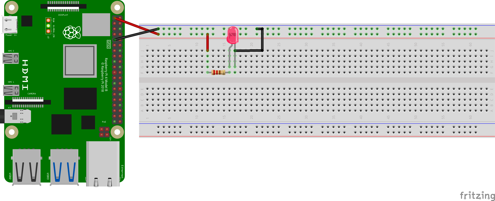
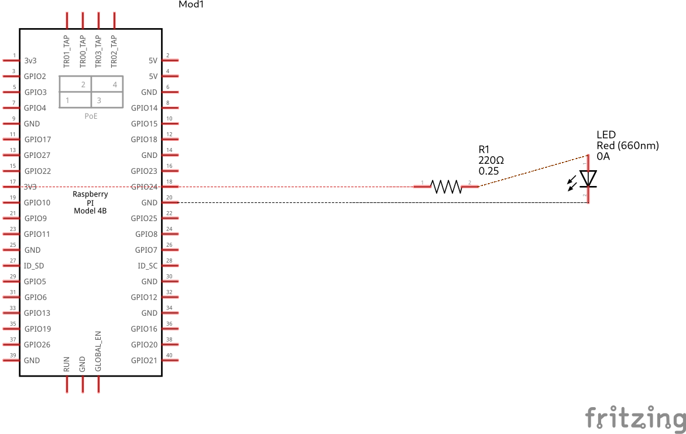

# Lighting an LED

#### Components List
  1. LED
  1. Resistor (330 Ω (ohms))
  1. 2 - Female to male connectors
  1. 2 - Male to male connectors
 
**Note that Board numbering is used, NOT  Broadcom numbering**
1. #### Pin 1 (3.3V power)
1. #### Pin 9 (GND)

---
#### GPIO Pinout
Refer to this diagram to understand the pins we are using

**Note that Board numbering is used NOT  Broadcom numbering**
1. ##### Pin 1 (3.3V power)
1. ##### Pin 9 (GND)

  

---

#### Diagram Scematic

  

#### Circuit Schematic

  

---

### Description
Since pin 1 is always ON delivering 3.3V, we can use it to connect an LED. 
The resistor is to ensure we do not fry the LED.
The ground connection is to complete the circuit.