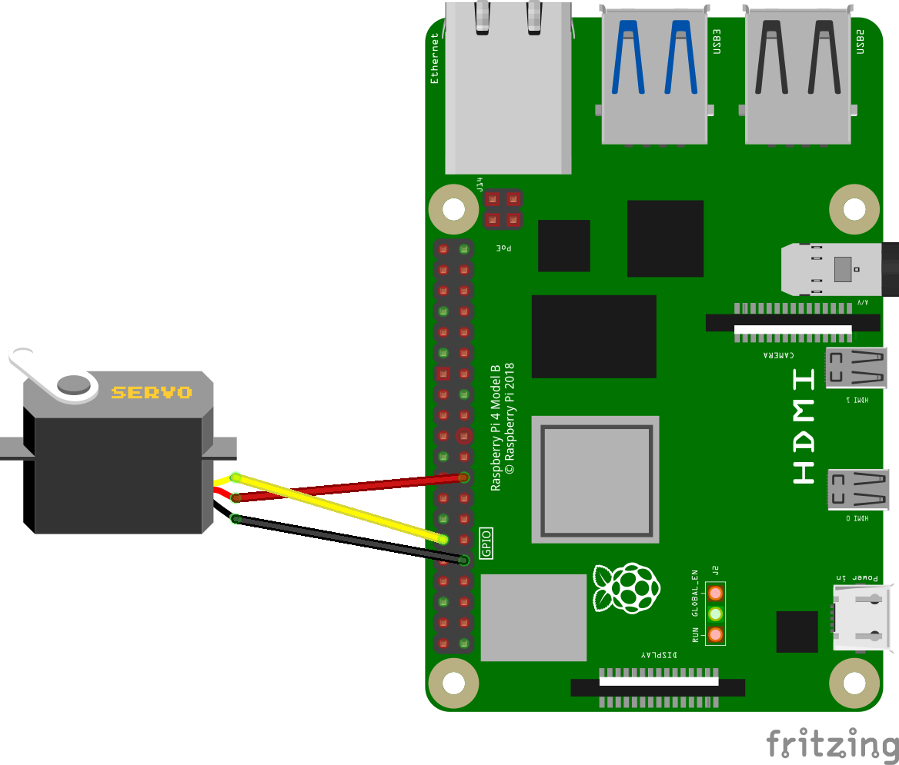
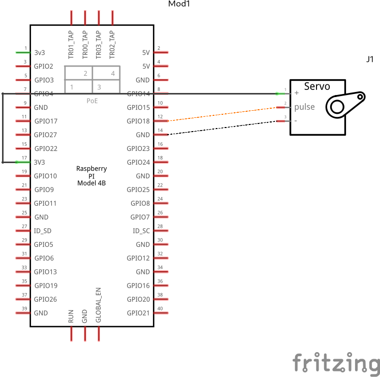

# Servo Motors
Servo motors are a type of motor that don't spin around in a complete circle.
It is used to move in precise rotational or angular motion by convering the appropriate electical signals.

Servo motors are controlled using pulse width modulation (PWM) signals. The control signal consists of a repeating pulse with a variable width. The width of the pulse determines the desired position of the servo motor. By varying the pulse width, the servo motor can be positioned at specific angles within its range of motion.

---
## Example implementation
#### Components List
  1. Tower Servo Motor
  1. 3 - Female to male connectors
 
**Note that Board numbering is used, NOT  Broadcom numbering**
1. #### Pin 9 (GND)
1. #### Pin 12 (Servo Control)
1. #### Pin 17 (3.3V Vcc)

---
#### GPIO Pinout
Refer to this diagram to understand the pins we are using

**Note that Board numbering is used NOT  Broadcom numbering**

<p align="center">
  
</p>

---

#### Diagram Scematic

<p align="center">
  
</p>

#### Circuit Schematic
<p align="center">
  
</p>

---

### Description
This implimentation prompts the user for a duty cycle to move the servo motor by. 
The duty cycle parameters for 0<sup>0</sup> to 180<sup>0</sup> is 2 < x < 12 where x is the duty cycle.

[PWM](pwm.md).


###### servo.py
```py
# The code for a servo motor
import RPi.GPIO as GPIO
from time import sleep

# Board Setup
GPIO.setmode(GPIO.BOARD)

# Servo pin
servo = 12
GPIO.setup(servo, GPIO.OUT)
servoCtrl = GPIO.PWM(servo, 50) # Servo control object running at 50Hz
servoCtrl.start(0)


try:
  print("<ctrl> + c to exit ")
  while True:
    dutyCycle = float(input("Enter Servo duty cycle: "))
    servoCtrl.ChangeDutyCycle(dutyCycle)
except KeyboardInterrupt:
  GPIO.cleanup()
  print("\nExiting...\n")
```
The code. [link](../../iot/basic/servo/servo.py)