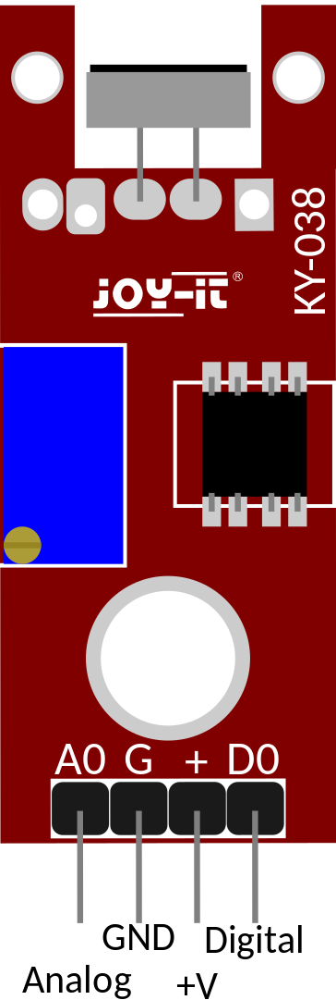
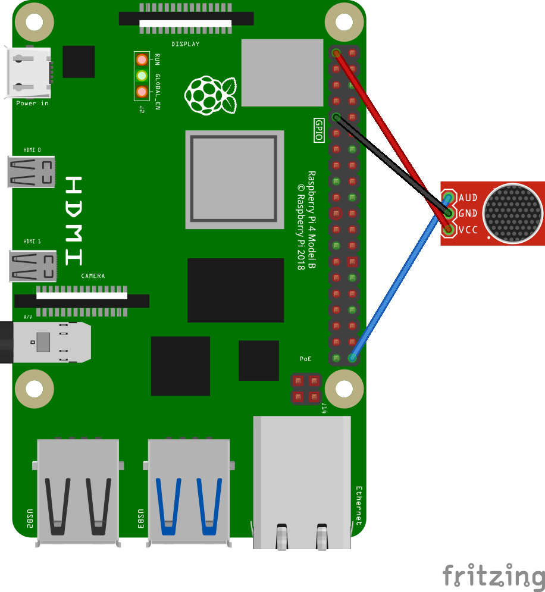

# Sound Threshold Testing & Alert [KY-038]

The **KY-038** sound sensor is good for threshold measurement.
It has both digital and analog outputs.

It emits a high digital signal as soon as the threshold value is exceeded. 

The analog output is cannot be read directly by the Rasperry Pi without some form of analog to digital conversion hence in this implimentation we will only consider the digital output.

The electrical condenser microphone is the primary component responsible for detecting sound. When sound waves reach the microphone, they cause the diaphragm to vibrate, generating a small electrical signal. The amplifier circuit amplifies this signal to a level suitable for microcontrollers to process.

The KY-038 sensor module typically includes a potentiometer to adjust the sensitivity of the microphone. You can adjust this sensitivity to make the sensor more or less responsive to sound signals, depending on your project's requirements.

## [DATASHEET](<../docs/KY-038 DATASHEET.pdf>)

# IMPLIMENTATION 
A program that detects and alerts when a certain threshold is reached.

### Operation
It has 4 pins

  1. Vcc - **5V supply**
  1. GND - Ground Connection
  1. Digital Output
  1. Analog Output

<p align="center">

</p>

---
## Example implementation
#### Components List
  1. 1 - KY-038 Sensor
  1. 3 - Female to male connectors
 
**Note that Board numbering is used, NOT  Broadcom numbering**
1. #### Pin 2 (5V Vcc)
1. #### Pin 9 (GND)
1. #### Pin 40 (Digital Output)

---
#### GPIO Pinout
Refer to this diagram to understand the pins we are using

**Note that Board numbering is used NOT  Broadcom numbering**

<p align="center">
  
</p>

---

#### Diagram Scematic

<p align="center">
  
</p>
---

```py
# A program that detects sounds that exceed a certain threshold and reports on it
# after reportin a small timeout is initiated to prevent reporting the same distrubance over and over again

import RPi.GPIO as GPIO
from time import sleep

# Board Setup
GPIO.setmode(GPIO.BOARD)

# KY-038 Digital output pin
mic = 40
GPIO.setup(mic, GPIO.IN, pull_up_down=GPIO.PUD_DOWN) # Setting up a pull down resistor to prevent intermittent state reads

# Instance counter
i = 0

# Sleep delay
delay = 2


try:
  while True:
    if(GPIO.input(mic) == True):
      i += 1
      print("Sound disturbance detected, instance no %d" %i)
      sleep(delay) 

except KeyboardInterrupt:
  GPIO.cleanup()
  print("\nExiting...\n")
```
Code [link](../../iot/basic/sound_sensor/sound_sensor.py).