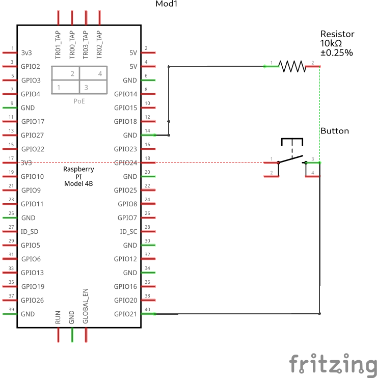
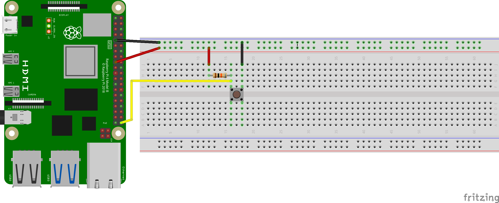
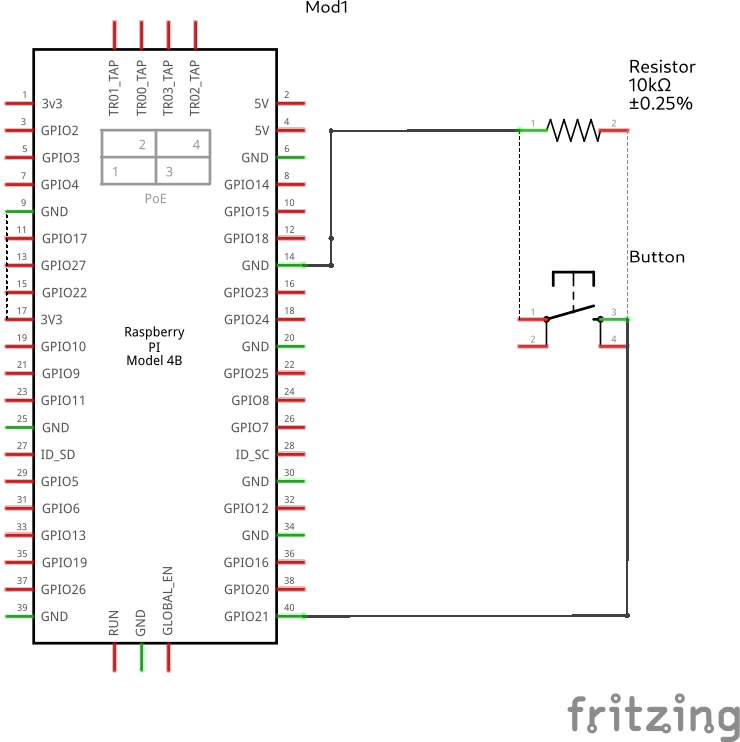
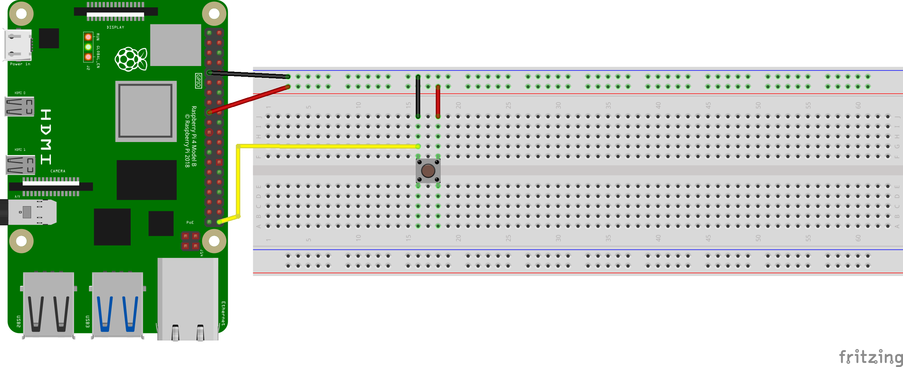
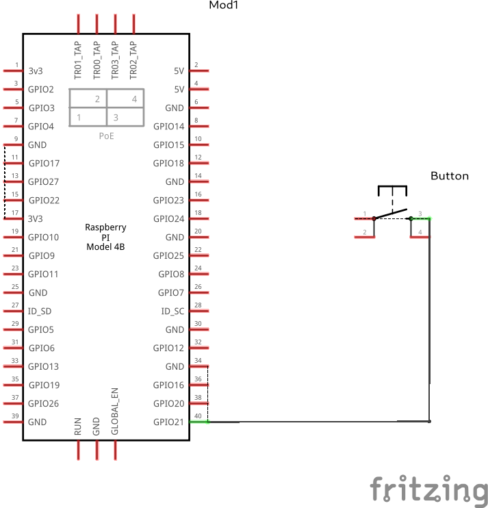

# Step Up and Step Down resistors
In digital logic circuits, resistors are used for 3 main reasons
  1. Current Limiting
  1. Impedence Matching
  1. Pull Up or Pull Down resistors

**Pull-up and Pull-down Resistors:** These resistors are used to establish a known logic level when a digital input is not actively driven by a signal source. A pull-up resistor connects the input to a voltage level (usually Vcc) to ensure it reads as logic high when not driven. A pull-down resistor connects the input to ground to ensure it reads as logic low when not driven. This helps prevent the input from floating and provides stability to the circuit. i.e., avoiding the **Indeterminate state** (Ƶ<sub>α</sub>) 

#### Components List
  1. Resistor (10K Ω (ohms))
  1. 3 - Female to male connectors
  1. 2 - Male to male connectors
  1. 1 - Push button

**Note that Board numbering is used, NOT  Broadcom numbering**
1. #### Pin 9 (GND)
1. #### Pin 17 (3.3V Vcc)
1. #### Pin 40 (GPIO INPUT PIN)


---
#### GPIO Pinout
Refer to this diagram to understand the pins we are using

<p align="center">
  
</p>

---

## Step Up implementation
Note the input connection to Vcc

#### Diagram Scematic

<p align="center">
  
</p>

#### Circuit Schematic
<p align="center">
  
</p>

## Step Down implementation
Note the input connection to GND

#### Diagram Scematic

<p align="center">
  
</p>

#### Circuit Schematic
<p align="center">
  
</p>


---

### Description
Given the python program supplied with this implementation, it will showcase the ability to use step up and step down transistors to read output.

###### push_up_down.py

```py
# A program that showcases the importance of a step up or step down resistor
# To avoid the indeterminate state
# The program will work independent of which implementation of step up or step down is used

import RPi.GPIO as GPIO
from time import sleep

# The input read pin 
inPin = 40

# Board setup and config
GPIO.setmode(GPIO.BOARD)
GPIO.setup(inPin, GPIO.IN)

try:
  pinState = GPIO.input(inPin)
  while(1):
    if(pinState != GPIO.input(inPin)):
      print(GPIO.input(inPin))
      # Momentary pause because the loop executes multiple times a second
      sleep(.25)

except KeyboardInterrupt:
  GPIO.cleanup()
```

The code [link].(../../iot/basic/push%20up%20%26%20push%20down/push_up_down.py)


# INTERNAL PUSH DOWN & PUSH UP RESISTORS

The Raspberry Pi has internal components that can be used as a push down or push up resistor without the need of implemenitng it on a real board.

It utilizes the RPi.GPIO.setup() method to configure a GPIO pin as either a push up or push down resistor. 

e.g.

##### A normal GPIO input pin setup
```py
  GPIO.setup(pinNumber, GPIO.IN)
```

PUSH UP
```py
  GPIO.setup(pinNumber, GPIO.IN, pull_up_pull_down=GPIO.PUD_UP)
```
PUSH DOWN
```py
  GPIO.setup(pinNumber, GPIO.IN, pull_up_pull_down=GPIO.PUD_DOWN)
```
## Step Up implementation
Note the input connection to Vcc

#### Diagram Scematic

<p align="center">
  
</p>

#### Circuit Schematic
<p align="center">
  
</p>

## Step Down implementation
Note the input connection to GND

#### Diagram Scematic

<p align="center">
  
</p>

#### Circuit Schematic
<p align="center">
  
</p>

--- 
##### internal_push_up.py

```py
# This code utilizes the internal step up functionality of the RPi
# There is no need to utilize breadboad step up resistors

import RPi.GPIO as GPIO
from time import sleep

# Board setup mode
GPIO.setmode(GPIO.BOARD)

# The input pin for the push button read
inPin = 40

# setting up the button
GPIO.setup(inPin, GPIO.IN, pull_up_down=GPIO.PUD_UP)

try: 
  while True:
    sleep(0.1)
    if(GPIO.input(inPin) == 0):
      print(GPIO.input(inPin))

except KeyboardInterrupt:
  GPIO.cleanup()
  print("Exited\n")
```

The code [link].(<../../iot/basic/push up & push down/internal_push_up.py>)

##### internal_push_down.py

```py
# This code utilizes the internal step up functionality of the RPi
# There is no need to utilize breadboad step up resistors

import RPi.GPIO as GPIO
from time import sleep

# Board setup mode
GPIO.setmode(GPIO.BOARD)

# The input pin for the push button read
inPin = 40

# setting up the button
GPIO.setup(inPin, GPIO.IN, pull_up_down=GPIO.PUD_DOWN)

try: 
  while True:
    sleep(0.1)
    if(GPIO.input(inPin) == 1):
      print(GPIO.input(inPin))

except KeyboardInterrupt:
  GPIO.cleanup()
  print("Exited\n")
```

The code [link].(<../../iot/basic/push up & push down/internal_push_down.py>)