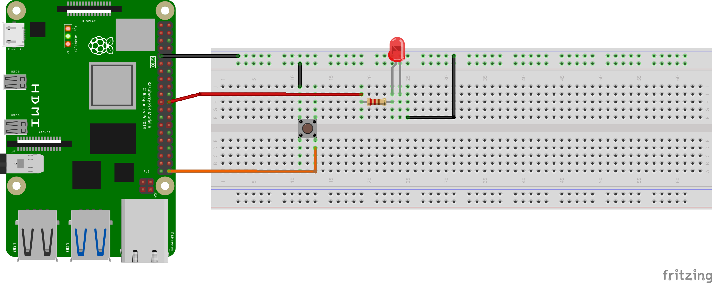
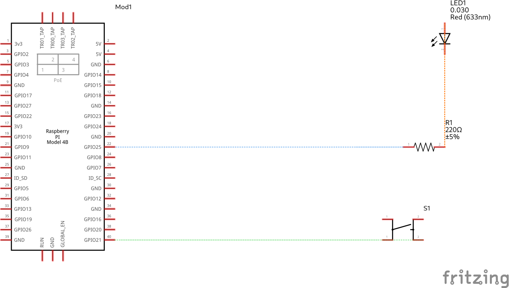

# Toggle an LED

#### Components List
  1. LED
  1. Resistor (330 Ω (ohms))
  1. 2 - Female to male connectors
  1. 2 - Male to male connectors
 
**Note that Board numbering is used, NOT  Broadcom numbering**
1. #### Pin 1 (3.3V Vcc)
1. #### Pin 9 (GND)
1. #### Pin 36 (Led Toggle Output)
1. #### Pin 40 (Button Toggle Input)


---
#### GPIO Pinout
Refer to this diagram to understand the pins we are using

**Note that Board numbering is used NOT  Broadcom numbering**

<p align="center">
  
</p>

---

#### Diagram Scematic

<p align="center">
  
</p>

#### Circuit Schematic
<p align="center">
  
</p>

---

### Description
This implementation toggles an LED on or off given its current state and after a complete push button press and release.

The code implementation is as follows

```py
# This program toggles an LED on or off 
# it utilizes the internal pull down resistor for gpio input

import RPi.GPIO as GPIO
from time import sleep

# Led Flag state
FLAG = 0

# The push button state
currState = 1
currStateOld = 1

# Board Setup Config
GPIO.setmode(GPIO.BOARD)

# Read pin
inPin = 40
GPIO.setup(inPin, GPIO.IN, pull_up_down=GPIO.PUD_DOWN)

# LED pin
ledPin = 36
GPIO.setup(ledPin, GPIO.OUT)

i = 0

try:
  while True:
   currState = GPIO.input(inPin)
   if(currState == 1 and currStateOld == 0):
     # Toggle the led
     i += 1
     print("Toggled ", i)
     FLAG = not FLAG
     GPIO.output(ledPin, FLAG)

   currStateOld = currState

except KeyboardInterrupt:
    GPIO.cleanup()
    print("\nExited\n")
```
