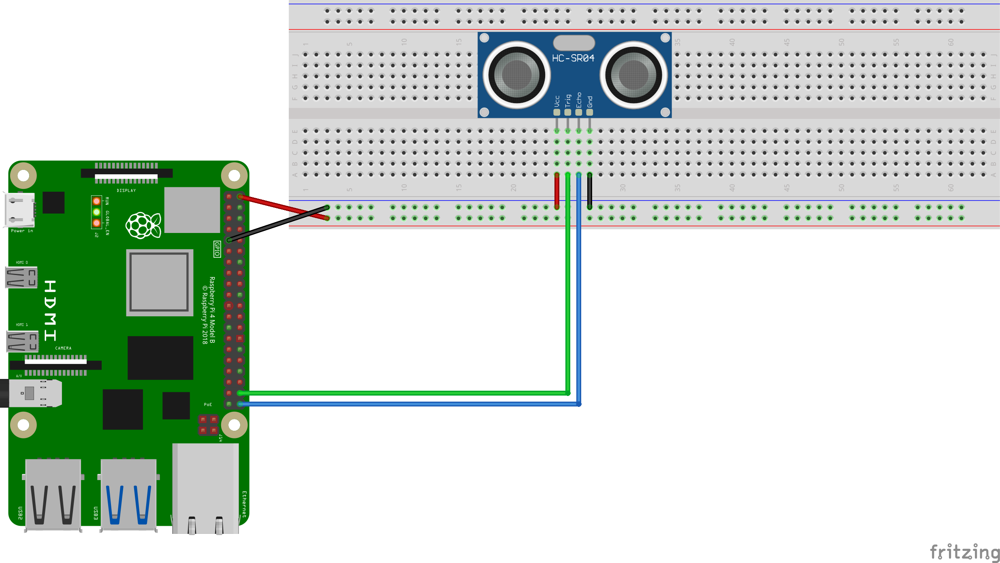

# Ultrasonic Distance Testing

The HC-SR04 sensor provides distance measurements with reasonable accuracy within a certain range (2cm - 400cm).

### Operation
It has 4 pins

  1. Vcc - **5V supply**
  1. Trig - A signal sent to the sensor to trigger emmit and receive functions on the component
  1. Echo - Emits a signal that can be observed 
  1. GND - Ground Connection
<p align="center">

</p>

---
## Example implementation
#### Components List
  1. 1 - Ultrasonic Sensor (HC-SR044)
  1. 4 - Female to male connectors
 
**Note that Board numbering is used, NOT  Broadcom numbering**
1. #### Pin 2 (5V Vcc)
1. #### Pin 9 (GND)
1. #### Pin 38 (Trig)
1. #### Pin 40 (Echo)

---
#### GPIO Pinout
Refer to this diagram to understand the pins we are using

**Note that Board numbering is used NOT  Broadcom numbering**

<p align="center">
  
</p>

---

#### Diagram Scematic

<p align="center">
  
</p>

#### Circuit Schematic
<p align="center">
  
</p>

---

### Operation
##### Trigger Signal
The trigger signal prompts the sensor to emit ultrasonic waves, listen for them and indicate when the signal has been received.
The characteristic of the signal is a prolonged low signal followed for a high signal maintained for 10µs, then a low signal until the next trigger signal is sent.


##### Echo Signal
After the trigger signal is sent, the sensor will emit a high signal on the echo channel after an undefined time. When the signal falls, it indicates the waves have made a round trip from the sensor to the target.

##### Calculating Distance
The speed of sound in air is 330m/s (at room temp). The round trip time should be divided into two then multiplied by the speed of sound to get distance.

###### ultrasonic_distance.py
```py
# A program that measues the distance between the front of a HC_SRQ4 ultrasonic sensor to a target within range

import RPi.GPIO as GPIO
import time

GPIO.setmode(GPIO.BOARD)

# Pins
echo = 40
trig = 38

GPIO.setup(trig, GPIO.OUT)
GPIO.setup(echo, GPIO.IN)

# Sends a trigger signal to the sensor requesting it to do it's magic
def sendTrigger():
  GPIO.output(trig, 0)
  time.sleep(2E-6)
  GPIO.output(trig, 1)
  time.sleep(10E-6)
  GPIO.output(trig, 0)

# Returns the time delta of a round trip time for the sensor's signal
def delta() -> float:
  while GPIO.input(echo) == 0:
    pass
  start = time.time()
  while GPIO.input(echo) == 1:
    pass
  end = time.time()

  # Converting from micro seconds to seconds
  return (end - start) * 1E6

# Returns the distance between the sensor and the object in centimeters
def distance(delta: float) ->float:
  # Halfing the time taken
  delta *= 0.5
  speed = 330 #  330m/s

  # Converting the distance to centimeters
  return (delta * speed) * 100

try: 
  while True:
    sendTrigger()
    print(distance(delta()), "cm")
    time.sleep(.5)

except KeyboardInterrupt:
  GPIO.cleanup()
  print("\nExiting...\n")
```
The code. [link](../../iot/basic/ultrasonic/ultrasonic_distance.py)