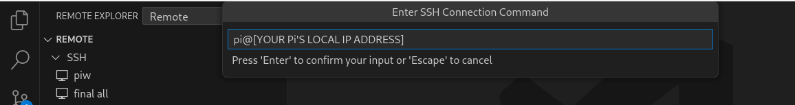

# Raspberry Pi IoT Journey

A repository where I teach myself IoT technology based on the Raspberry Pi 4 Model B. The repository contains resources, tutorials and projects I have acquired developed along the way.

This repository should be treated as a way to showcase projects as well as serve as a 'how to'  that guides people to replicate said projects, not to be confused as an educative authority on the subject matter.  

¡Vamonos! Let's go!

# Projects

<div id="projects-quick-look" style="display: inline-block;">
<a href='https://github.com/kimeudom/rpi/blob/master/.assets/md%20projects/temp_humid.md'>
<div >

<p align="centre">Temperature And Humidity Detection Project</p>
</div>
</a>

<a href='https://github.com/kimeudom/rpi/blob/master/.assets/md%20projects/motion_sensor.md'>
<div>

<p align="centre">Motion Detection Project</p>
</div>
</a>
</div>

## Table of Contents

  1.  [Getting Started](#getting-started)
  2.  [Hardware Setup](#hardware-setup)
  3.  [Software Setup](#software-setup)
  3.  [Basics](#basics)
  4.  [Projects](#projects)
  5.  [Resources](#resources)
  6.  [Contributing](#contributing)
  7.  [License](#license)

### Getting Started <a name="getting-started"> </a>
My current setup involves interacting with the pi using the General Purpose Input/Output pins (GPIO) pins connected to components which are driven by Python programming logic.

To interact with the pi, I used headless 32-Bit Raspberry OS lite install running VS-Code Server over SSH (on the same LAN connection) to program and interact with the system. (Details to achieve this is in the **[software setup](#software-setup)** section).  

The hardware component setup will be in the form of simulated diagrams.

### Hardware Setup<a name="hardware-setup"> </a>
The basic hardware to use for the basic segment of this repository:
###### Basic Parts list
  1. Raspberry PI 4 model b
  1. SD Card (32Gb minimum) 
  1. **5V** Power Source (wall/ stored power)  
  1. Bread Board(s)
  1. LEDs(s)
  1. Resistors(s)
  1. Connectors(MM, MF, FF)
  1. Push Button(s)
  1. Capacitor(s)
  1. Motors(s)
  1. Dot matrix display(s)
  1. Digital Display(s)
  1. LCD display(s)


### Software Setup<a name="software-setup"> </a>

#### Raspberry OS setup
Setting up the headless 32-bit Raspberry OS lite.
  **Steps**
  - Install [Raspberry Pi Imager](https://www.raspberrypi.com/software/) [Link to the official site]

    **Windows systems**

      Install the setup from the link above

    For Linux systems

    Debian

      ```$ sudo apt install rpi-imager```

    Fedora

      ```$ sudo dnf install rpi-imager```

  - Plug in your SD card to your pc
  - Run the Raspberry Pi Imager 
      Be sure to run the program on sudo mode or as administrator to enable write operations to disks (in this case, the SD card)

    **Windows systems**

     Run the Raspberry Pi Imager as Administrator 
For Linux systems
      ```$ sudo rpi-imager```

  - Select the 32-bit image and the relevant SD card

    [Selecting](.assets/src/videos/select%20image%20and%20sd%20card.mkv)
  - Setup the configuration for the device
    <p>
    
    </p>


  - Write to disk and vertify
  <p align="center">
  
  </p>
  <p align="center">
  
  </p>
  <p align="center">
  
  </p>

  - SSH into the Pi

      Aquire your Pi's local IP address from your router and use it to SSH into the board.

      ```$ ssh [YOUR USER NAME]@[YOUR HOST NAME/ Local IP]```

      Update the firmware before proceeding

      ```$ sudo apt-get update && sudo apt-get upgrade```
      
  - Setup VS Code server

    - On your PC's VS Code, install the extention below
    [remote-ssh (marketplace link)](https://marketplace.visualstudio.com/items?itemName=ms-vscode-remote.remote-ssh)

   <p align="center">
   
   </p>

  - Add a remote host

 <p align="center">
   
   </p>

  - Enter the SSH information

 <p align="center">
   
   </p>

  - VS Code will setup the remote server

 <p align="center">
   
   </p>

 <p align="center">
   
   </p>


   With the hardware and software setup, you can proceed to the basics section

### Basics<a name="basics"> </a>

  1. [Lighting an LED](.assets/md%20files/lighting_LED.md)

     A hello world of sorts.

  1. [RGB LED](.assets/md%20files/RGB.md)
    
      A way to control RGB LED configurations to achieve any colour.

  1. [Blinking an LED](.assets/md%20files/blinking_LED.md)

      An improvement of the above that uses python logic to blink the led indefinately or for a set number of times.

  1. [Step Up and Step Down resistors](.assets/md%20files/push_up_down.md)

      Why when expecting input from a GPIO pin, it is good to consider a step up or step down resistor to avoid the indeterminate state (Ƶ<sub>α</sub>) [link](.assets/md%20files/push_up_down.md).

  1. [Toggle Switch](.assets/md%20files/toggle.md)

      A way to toggle an LED on or off.
  
  1. [Pulse Width Modulation](.assets/md%20files/pwm.md)

      Pulse Width Modulation (PWM) is a technique used to encode infromation in a signal or control power delivery of systems.
      By varying a signal (in this case a square wave signal) to regulate power supplied to a load.

  
  1. [Servo Motor](.assets/md%20files/servo.md)

      A servo motor is a sensory actuator that allows for precise control of angular or linear position.
  
  1. [Ultrasonic Sensor](.assets/md%20files/ultrasonic.md)

      Using ultrasonic waves to measure distances. Using the HC-SRO4 ultrasonic sensor(range 2cm to 400cm) ***Operating voltage is 5V.***

  
  1. [Displays](.assets/md%20files/displays.md)

      A guide on how to use an array of displays e.g., dot matrix displays, segment displays (1 digit and 4 digit displays), led bar segment display, lcd displays e.t.c. 

  1. [Motion Sensor](.assets/md%20files/motion_sensor.md)
      Using a Passive InfRared (PIR) motin senosr to detect target movement in front of the sensor. 
      This can be used as a trigger mechanism for a larger operation. e.g., turning lights on/off, setting of an alarm etc.

### Projects<a name="projects"> </a>
#### 1. [Temperature and Humidity Sensor Project](.assets/md%20projects/temp_humid.md)

  A project that shows real time ambient temperature and humidity captured by the DHT11 sensor and displayed on the 1602A LCD display.

#### 1. [Motion Detection Project](.assets/md%20projects/temp_humid.md)

  Given a target area monitored by a Passive InfRared (PIR) sensor, this project reports the number of detected disruptions in the area.


### Resources<a name="resources"> </a>
#### 1. Fritzing
Fritzing. (Version 0.9.3b). Fritzing. Retrieved from https://fritzing.org

#### 2. Youtube @paulmcwhorter
Awsome video series on RPi stuff. https://youtube.com/playlist?list=PLGs0VKk2DiYxdMjCJmcP6jt4Yw6OHK85O

### Contributing<a name="contributing"> </a>

### License<a name="license"> </a>
This project is licensed under the [MIT License](https://mit-license.org/). You can find the full text of the license in the [LICENSE](./LICENSE) file.
